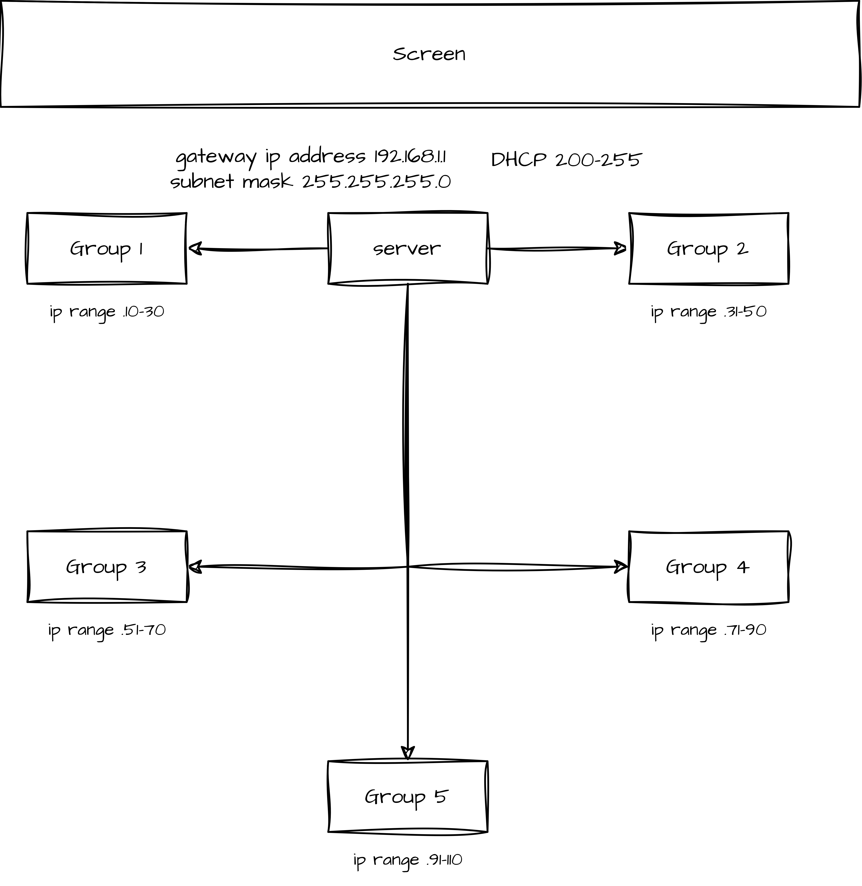

# Network for EPICS Summer School

# First task

1. Connect all the devices that you need to use for the project
2. Assign static IP to your PCs 
3. Connect devices that you will use for the project (some of them may require setting static IP or even configuring a device which already had a different IP assigned)

